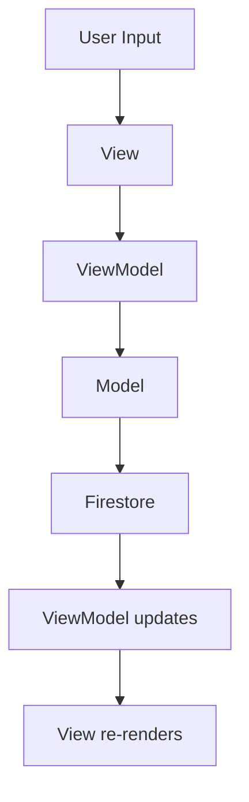

# 🔄 Kninanino – App Data Flow Map

This document explains how data flows between views, view models, models, and services in the Kninanino app.

---

## 🧠 Architectural Pattern

- Kninanino uses a **MVVM (Model-View-ViewModel)** architecture.
- SwiftUI `Views` interact with `ObservableObject` ViewModels, which fetch and modify data.
- Data is passed through Bindings or @Published state.

---

## 📊 Data Sources

| Source        | Used For                       |
|---------------|--------------------------------|
| Mock Data     | Prototyping & development      |
| Firestore     | Production user/project data   |
| User Input    | Creating/updating journal logs |

---

## 🧵 Sample Data Flow: Creating a Project Journal Entry

1. **User taps "New Entry"**
2. → View presents a form bound to `ProjectJournalViewModel`
3. → On submit, `ViewModel` creates `ProjectJournal` object
4. → `ViewModel` saves it to Firestore via `DataService`
5. → Once saved, journal appears in `ProfileView` via project ID filtering

```
User Action
   ↓
ProjectJournalView
   ↓ binds to
ProjectJournalViewModel
   ↓ calls
DataService.saveJournal()
   ↓ stores in
Firestore
   ↓ reload triggers
ProjectJournal list in ProfileView
```

---

## 🛠 Core View ↔ ViewModel Pairs

| View               | ViewModel                 |
|--------------------|---------------------------|
| `ProfileView`      | `ProfileViewModel`        |
| `ProjectView`      | `ProjectViewModel`        |
| `GaugeEntryView`   | `GaugeSwatchViewModel`    |
| `JournalEntryView` | `ProjectJournalViewModel` |

---

## 🌐 Example: Data Fetch on App Launch

```plaintext
App Entry
   ↓
ContentView loads ProfileView
   ↓
ProfileViewModel fetches User & Projects
   ↓
Each Project loads gauge swatches & journals
```

---

## 🌈 Future Notes

- Cloud sync (Firestore) will be added with a FirestoreService.swift file.
- Offline support (optional) may require local caching or CoreData fallback.

---

## 🧩 Mermaid Diagram (for GitHub / VSCode)


